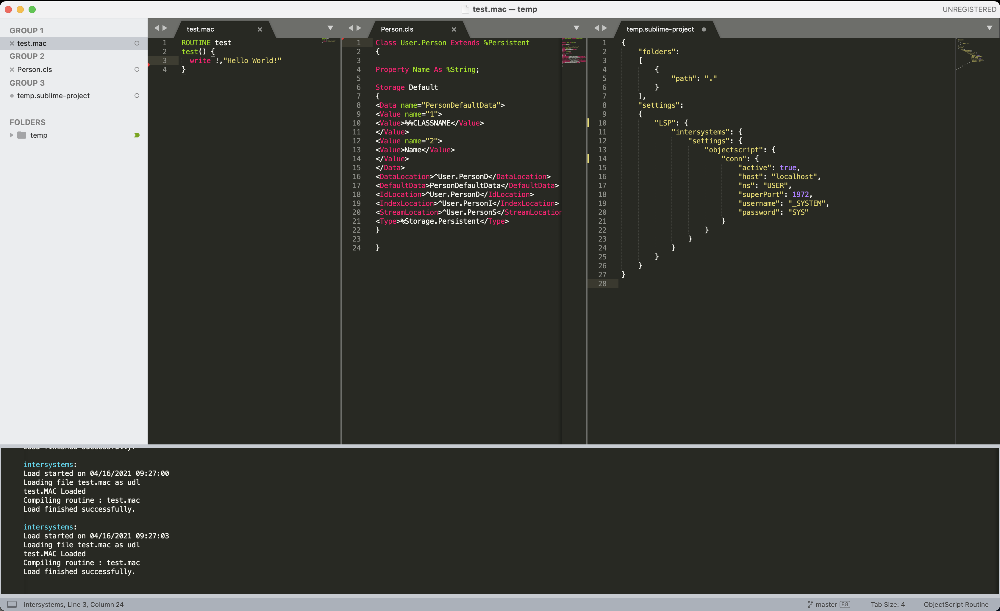

# How to install and use InterSystems Language Server in SublimeText3

* Download the latest version of this Language Server from [releases page](https://github.com/caretdev/intersystems-ls/releases), extract it somewhere
* Install [Package-Control](https://packagecontrol.io/installation) in SublimeText3
* Install Syntax Highlighting for ObjectScript
  * In SublimeText in command pallette enter `Package Control: Add Repository`
  * Put this link: https://github.com/intersystems-community/ObjectScript.tmBundle
  * `Package Control: Install Package` search for `ObjectScript`, install it
* Install LSP plugin
  * `Package Control: Install Package` search for `LSP` (exact name), install it
* Menu `Preferences -> Package Settings -> LSP -> Settiings`
  * Update settings file, to make it soomething like below, in `command` set the correct path to extracted Language Server executable for your platform

  ```JSON
  {
    "clients": {
      "intersystems": {
        "enabled": true,
        "command": [
          "PATH/TO/intersystems-ls"
        ],
        "languages": [
          {
            "scopes": [
              "source.objectscript"
            ],
            "languageId": "objectscript",
            "syntaxes": [
              "Packages/ObjectScript.tmBundle/Syntaxes/objectscript.tmLanguage"
            ]
          },
          {
            "scopes": [
              "source.objectscript_class"
            ],
            "languageId": "objectscript_class",
            "syntaxes": [
              "Packages/ObjectScript.tmBundle/Syntaxes/objectscript-class.tmLanguage"
            ]
          }
        ]
      }
    }
  }
  ```

* Configure access to IRIS
  * Open Project Settings, or User's settings, add section with settings like this

  ```JSON
    "LSP": {
      "intersystems": {
        "settings": {
          "objectscript": {
            "conn": {
              "active": true,
              "host": "localhost",
              "ns": "USER",
              "superPort": 1972,
              "username": "_SYSTEM",
              "password": "SYS"
            }
          }
        }
      }
    }
  ```

* Command Pallette, `LSP: Toggle Log Panel` should show messages after save of changed files

